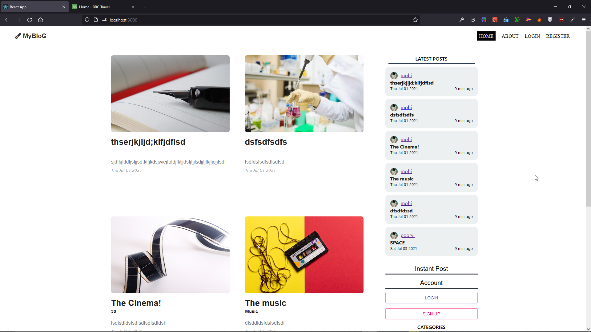
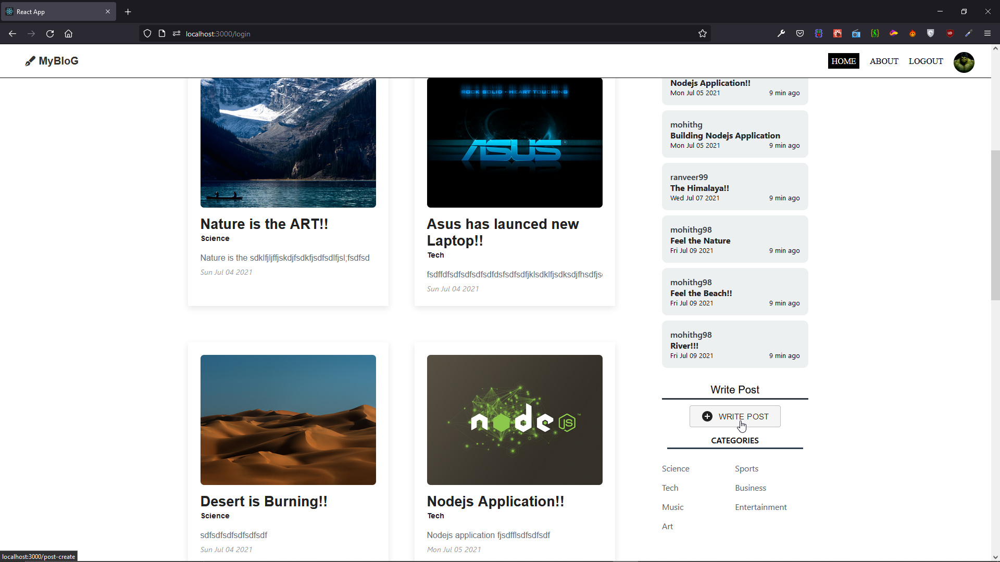
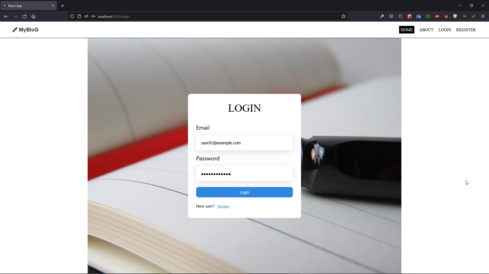
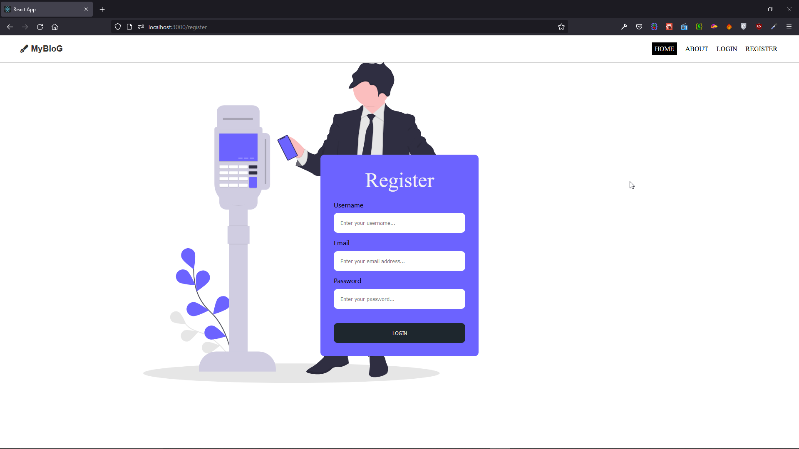
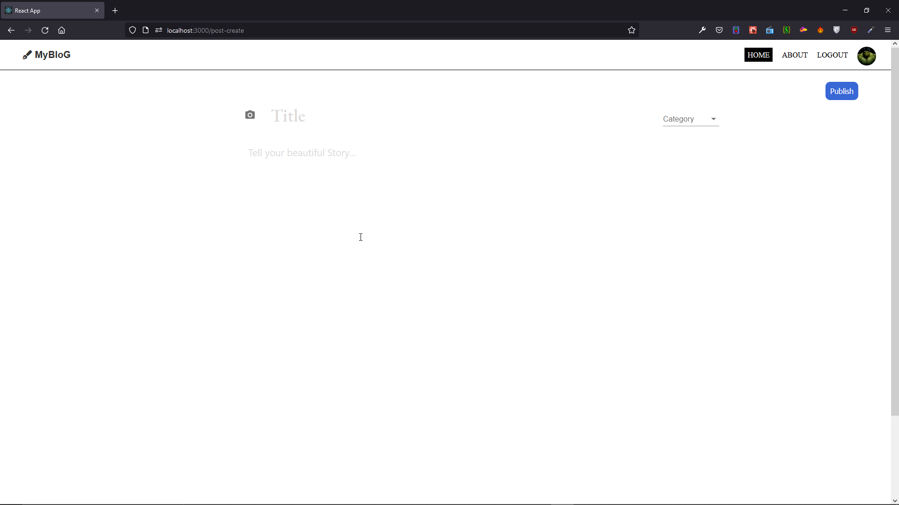
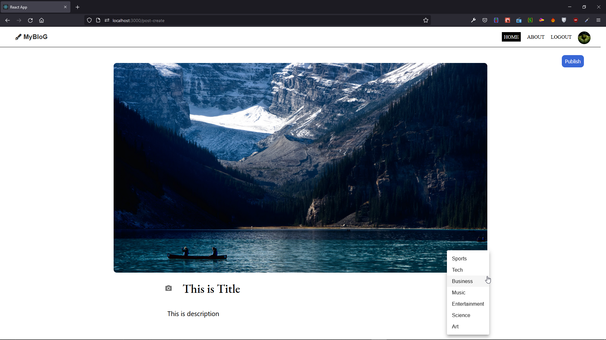
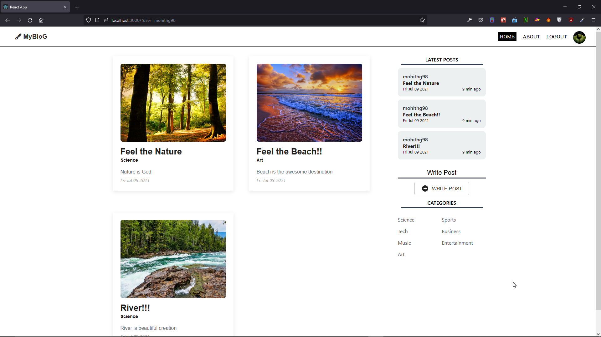
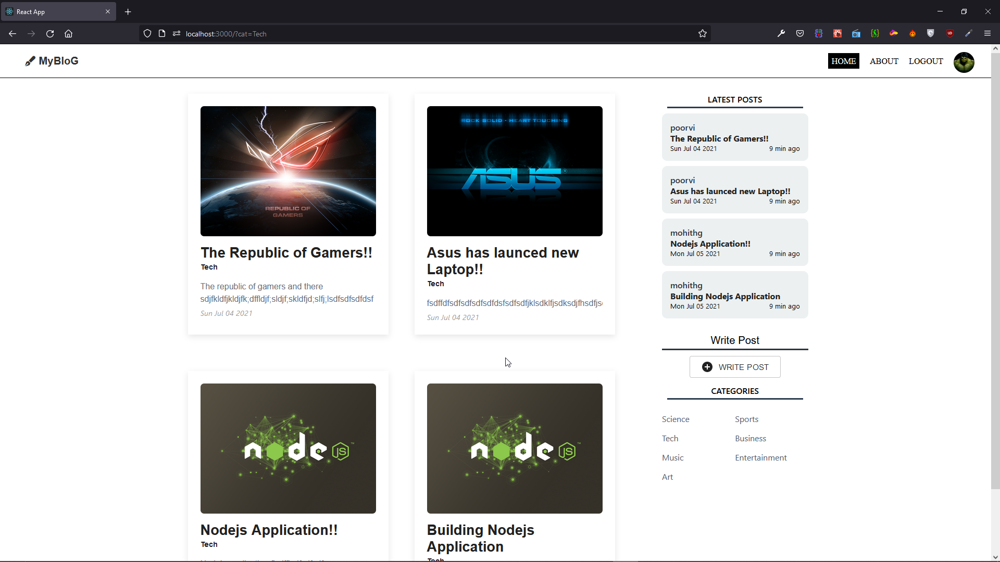

<h1 align="center">

MERN Blog Application
<br>

</h1>
<h4 align="center">This is an Blog Web Application Built with MERN stack, inspired by medium blog application.</h4>
<p align="center">
    
</p>

<p align="center">
  <a href="#key-features">Key Features</a> •
  <a href="#screenshots">Screenshots</a> •
  <a href="#technology-used">Technology Used</a>  •
  <a href="#how-to-use">How To Use</a> 
</p>


## Key Features

- User can create post which include's uploading File/Image.

- User can search specific user/author's posts and also categories based on user's interest.

- For quick Posts, User can click on sidebar(Right Side)

## Screenshots

1. Homescreen before user Login
   

2. Homescreen after user Login(create Button)
   

3. Login Screen
   

4. Register Screen
   

5. Before Creating Post
   

6. After Creating Post (before Publish)
   

7. search specific user/author posts
   

8. Also search category based on user's interest
   

---

## Technology Used:

This software uses the following open source packages:

- [React](https://reactjs.org/)
- [Node.js](https://nodejs.org/)
- [Mongoose](https://mongoosejs.com/)
- [Express](https://expressjs.com/)
- [Material UI (UI Framework/Design System)](https://material-ui.com/)

---

## How To Use

To clone and run this application, you'll need [Git](https://git-scm.com) and [Node.js](https://nodejs.org/en/download/) (which comes with [npm](http://npmjs.com)) installed on your computer. From your command line:

```bash
# Clone this repository
$ git clone Repo URL

# Go into the repository
$ cd project

# Install dependencies
$ npm install

# Run the app
$ npm start
```

Note: If you're using Linux Bash for Windows, [see this guide](https://www.howtogeek.com/261575/how-to-run-graphical-linux-desktop-applications-from-windows-10s-bash-shell/) or use `node` from the command prompt.

---

## To Be Continued 👨🏼‍💻
